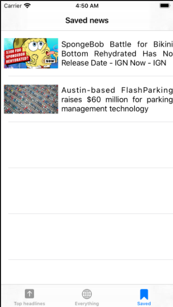
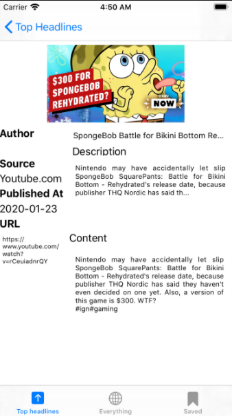

# Test_case (новостной аггрегатор)
Требуется написать новостное приложение использующее сервис News API для работы (https://newsapi.org). Основные функции приложения: 
показывать список топ новостей
отображать детали новости
сохранять новости для просмотра в будущем

Документация по API: https://newsapi.org/docs 
Ключ API: e65ee0938a2a43ebb15923b48faed18d

News API предоставляет новости по разным темам, ключевым словам, категориям (этот параметр обязательный). От вас требуется:

Выбрать какую-либо тему, в которой будет достаточно большой список новостей (Например, запрос по слову Apple дает нам около 900 результатов).
Реализовать страницу с 2-мя табами (Top headliens и Everything)
Реализовать 1ый таб, который будет отображать список новостей по выбранной теме из ендпоинта v2/top-headlines. Запрос в этот ендпоинт должен повторяться каждые 5 секунд и обновлять нужные новости в случае если изменилось что-либо.
Реализовать 2ой таб для всех новостей по этой же теме из ендпоинта v2/everything (повторять запросы не нужно, Swipe To Refresh будет достаточно).
Реализовать пагинацию: для обоих запросов в качестве параметров выбрать размер страницы 15 (в документации: параметр page и pageSize).
Реализовать страницу деталей новости
Реализовать возможность сохранения новостей в закладки для прочтения в будущем.

      
